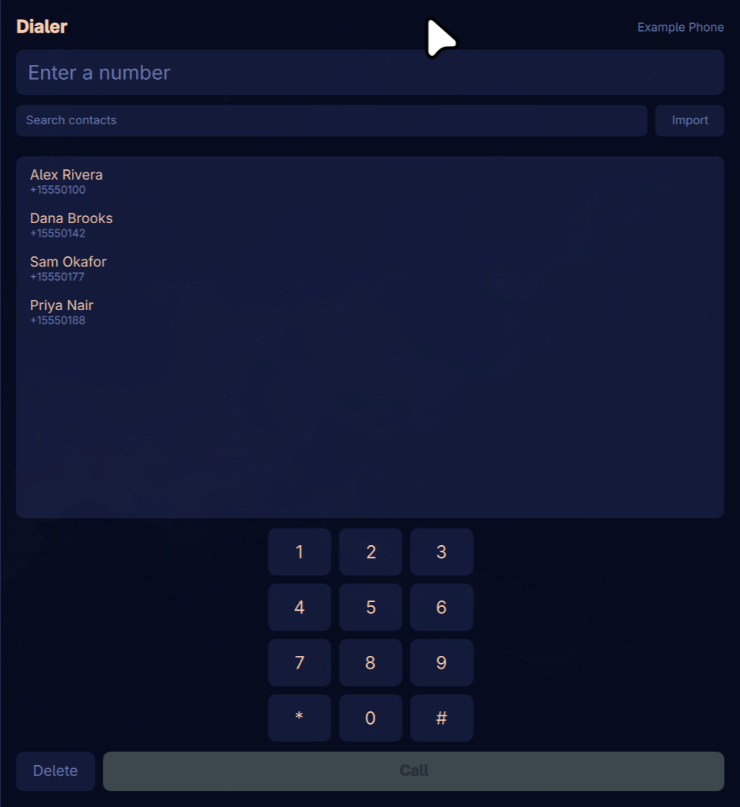
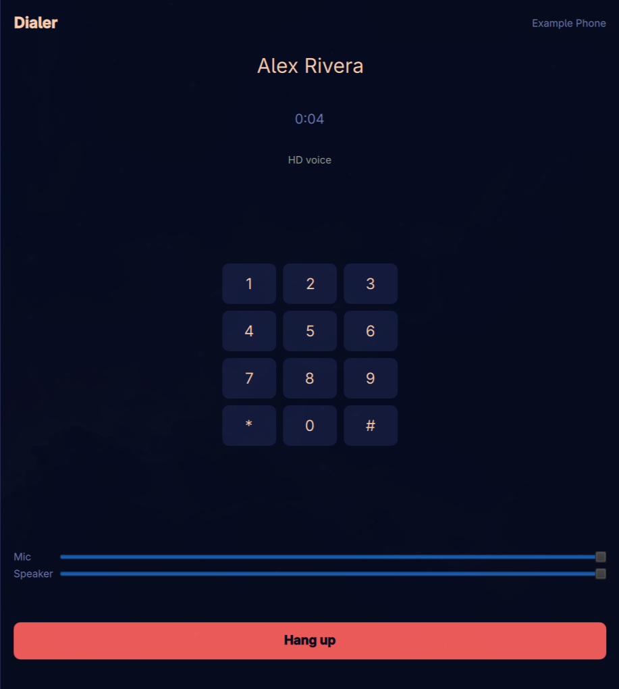
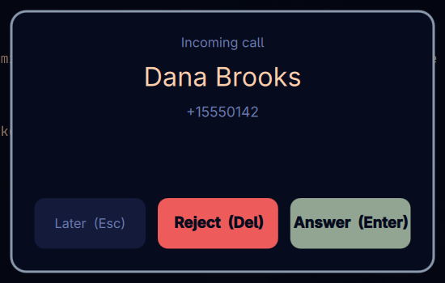

# Omarchy Dialer — make and receive phone calls on Linux from your Android phone

**Omarchy Dialer places, answers and ends real cellular phone calls from a Linux desktop, using a Bluetooth-paired Android phone as the radio.** Call audio runs through your PC's own microphone and speakers. There is no VoIP account, no SIP server and no cloud service — the call is a normal GSM call on your existing number and plan.

It is built for [Omarchy](https://omarchy.org) (Hyprland/Wayland) with [Quickshell](https://quickshell.org), and works on any Linux system with PipeWire 1.6+ and BlueZ 5.87+.



---

## Table of contents

- [How it works](#how-it-works)
- [Requirements](#requirements)
- [Install](#install)
- [Keyboard control](#keyboard-control)
- [Incoming calls](#incoming-calls)
- [The call bar](#the-call-bar)
- [Contacts: importing .vcf and .csv](#contacts-importing-vcf-and-csv)
- [Socket protocol](#socket-protocol)
- [Development](#development)
- [Troubleshooting](#troubleshooting)
- [FAQ](#faq)
- [What this does not do](#what-this-does-not-do)

---

## How it works

Your PC registers with the phone as a **Bluetooth Hands-Free unit** — the same role a car kit or headset plays. That single fact gives you two things at once: the audio path for the call, and an AT-command channel for dialling, answering and hanging up.

PipeWire 1.6 exposes this on the session bus as `org.pipewire.Telephony`, with no configuration required. A small Python daemon owns that D-Bus traffic and republishes it as newline-delimited JSON on a Unix socket. A standalone Quickshell application reads that socket and draws the interface.

```
Quickshell UI  ⇄  NDJSON over Unix socket  ⇄  omarchy-dialerd  ⇄  D-Bus  ⇄  PipeWire  ⇄  Bluetooth HFP  ⇄  phone
```

The socket is the only contract between the daemon and the interface. That boundary is deliberate: the UI can be developed and tested against a recorded event stream with no phone present, and any other client can drive the dialer with a few lines of shell.

### Why a daemon and not just QML?

Quickshell 0.3.1 ships no generic D-Bus client — it has `Socket`, `SocketServer`, `Process`, `FileView`, but nothing that can call an arbitrary bus method. The helper process is a structural requirement, not a stylistic preference.

---

## Requirements

| Component | Minimum | Why |
|---|---|---|
| **PipeWire** | 1.6.0 | Provides `org.pipewire.Telephony`; earlier versions have no call-control API |
| **WirePlumber** | 0.5 | Owns the telephony bus name |
| **BlueZ** | 5.87 | Hands-Free Profile support |
| **Quickshell** | 0.3.1 | `Socket`, `SplitParser`, `FileView`, `PanelWindow` |
| **PyGObject** | 3.56 | The D-Bus binding — already present on most desktops |
| **Phone** | Any handset advertising `0000111f` | Handsfree Audio Gateway; effectively all Android and iOS phones |
| `zenity` | optional | File dialog for the Import button only |

Check your phone advertises the right profile:

```bash
bluetoothctl info <MAC> | grep 111f
```

If `0000111f-0000-1000-8000-00805f9b34fb` appears, the phone can act as an audio gateway and this will work.

---

## Install

```bash
git clone https://github.com/karem505/omarchy-dialer.git
cd omarchy-dialer
./install.sh
```

The installer copies the app to `~/.local/share/omarchy-dialer`, adds a desktop entry so **Dialer** appears in your application menu, enables a systemd user service, and adds `hfp_hf` to WirePlumber's `bluez5.auto-connect` so the link comes up on boot. Your existing WirePlumber config is backed up first.

Pair your phone normally, then launch **Dialer**.

### Optional: float the window

Hyprland tiles the window by default. Omarchy uses Hyprland's Lua config parser, which rejects `hyprctl keyword windowrule` at runtime, so the rule has to live in your config. Add to `~/.config/hypr/looknfeel.lua`:

```lua
o.window({ class = "org.quickshell", title = "^Dialer$" },
         { float = true, size = "380 620" })
```

The installer prints this but does not edit your Hyprland config for you.

---

## Keyboard control

The window accepts keyboard and numpad input with no field needing focus.

| Key | Idle | During a call |
|---|---|---|
| `0`–`9`, `*`, `#`, `+` | Builds the number (numpad included) | Sent as **DTMF tones** |
| Any letter | Searches contacts | — |
| `Backspace` | Deletes from the search if active, otherwise the number | — |
| `Enter` | Places the call | — |
| `Escape` | Clears number and search | Hangs up |

Digits reach the network as DTMF while a call is connected, so typing during a call navigates phone menus rather than editing anything.



---

## Incoming calls

An incoming call raises a **layer-shell overlay**, not a window. The distinction matters: a window can only be raised if something raises it, and toggling `visible` on an already-open window does nothing. The overlay draws above fullscreen applications and appears on whichever workspace you are currently using.



| Action | Key | Effect |
|---|---|---|
| **Answer** | `Enter` | Answers the call |
| **Later** | `Esc`, `Down`, or click the backdrop | Hides the card, **the call keeps ringing** |
| **Reject** | `Del` / `Backspace` | Hangs up |

`Esc` deliberately does not hang up. Dismissing sends nothing to the daemon at all — the caller is untouched.

A dismissed call parks in a small pill beside your status bar showing the caller and an **Answer** button; clicking elsewhere on the pill restores the full card. The pill takes no keyboard focus and reserves no screen space.

The card also expires by itself after 45 seconds and falls back to the pill. That is a safety valve as much as a courtesy: the card holds *exclusive* keyboard focus, so it must never be able to stay up indefinitely.

---

## The call bar

Answering a call closes the overlay, and the Dialer window behind it is an ordinary floating window — buried under whatever you were working in, or sitting on another workspace. So for as long as a call is connected, a **call bar** sits under your status bar on every workspace.


| Control | Effect |
|---|---|
| **Mute** | Sets HFP microphone gain to zero, and back to full on unmute |
| **Keypad** | Expands a DTMF pad; while it is open, number keys send tones too |
| **Hang up** | Ends the call |

The bar is a layer-shell surface only as wide as its own contents, takes no keyboard focus until you open the keypad, and reserves no screen space, so it never displaces your windows. Each new call starts collapsed and unmuted.

The duration is timed from the moment the daemon saw the call connect, not from when the interface opened — so opening the window mid-call shows the real elapsed time. A call the daemon **adopted** already in progress (it was started before the daemon, or WirePlumber restarted underneath it) has no recoverable start time, and the bar reads `on call` rather than inventing a number.

---

## Contacts: importing .vcf and .csv

Many Android phones — ColorOS and its relatives in particular — refuse Bluetooth phonebook access (PBAP) outright, and KDE Connect's contacts plugin returns an empty book without Android permissions that cannot be granted from Linux. Omarchy Dialer therefore reads contacts from a file you import.

**Import accepts `.vcf` (vCard) and `.csv`, detected by file content rather than extension**, so a vCard saved under the wrong name still imports.

### vCard (.vcf)

The format phones actually export, and what PBAP would have delivered.

- Handles RFC 6350 line folding
- Falls back to the structured `N` field when `FN` is absent
- **Decodes quoted-printable**, including soft line breaks — vCard 2.1 encodes non-ASCII names as `FN;ENCODING=QUOTED-PRINTABLE:=D8=A3=D8=AD...`, and without decoding an Arabic name imports as that literal string
- Creates one callable entry per `TEL`, so a card with mobile and work numbers yields both under the same name

### CSV

Google Contacts exports work unchanged, as do simple `name,phone` sheets. The `Phone N - Type` column is deliberately ignored, so the word `Mobile` is never imported as a phone number.

### Matching and updating

Contacts are matched on the **last 9 digits**, so `+201000000001` and `01000000001` are recognised as one person. Re-importing an updated export therefore **updates names in place instead of creating duplicates**, and each import reports `added / updated / skipped`.

Incoming calls are named from this book when the network supplies no caller ID.

The book is stored at `~/.local/share/omarchy-dialer/contacts.json`.

### Non-Latin names

Names in any script work throughout — import, search, contact list and caller ID. Arabic search is orthography-folded, so searching `احمد` finds `أحمد`: alef variants, alef maqsura versus ya, ta marbuta versus ha, hamza carriers, tashkeel and tatweel are all folded away, because people rarely type the hamza.

---

## Socket protocol

`$XDG_RUNTIME_DIR/omarchy-dialer.sock`, mode `0600`, newline-delimited JSON. Any client can drive the dialer.

### Commands

| Command | Example |
|---|---|
| `dial` | `{"cmd":"dial","number":"+15550100"}` |
| `answer` | `{"cmd":"answer","call":"call1"}` |
| `hangup` | `{"cmd":"hangup","call":"call1"}` |
| `tones` | `{"cmd":"tones","digits":"123"}` |
| `set_volume` | `{"cmd":"set_volume","which":"mic","value":12}` |
| `contacts` | `{"cmd":"contacts"}` |
| `import_contacts` | `{"cmd":"import_contacts","path":"/path/to/contacts.vcf"}` |
| `refresh` | `{"cmd":"refresh"}` |

`set_volume` takes `mic` or `speaker` with a value of 0–15 — the HFP scale, not 0–100.

### Events

| Event | Example |
|---|---|
| `gateway` | `{"ev":"gateway","connected":true,"address":"AA:BB:CC:DD:EE:FF","name":"Example Phone"}` |
| `call` | `{"ev":"call","id":"call1","state":"active","line":"+15550100","started":1756570000.0}` |
| `call_removed` | `{"ev":"call_removed","id":"call1"}` |
| `transport` | `{"ev":"transport","state":"active","codec":2}` |
| `contacts` | `{"ev":"contacts","available":true,"count":4,"items":[…]}` |
| `imported` | `{"ev":"imported","added":3,"updated":0,"skipped":0}` |
| `error` | `{"ev":"error","cmd":"dial","message":"no gateway"}` |

On a `call` event, `started` is the Unix timestamp at which the call connected. It is omitted when the daemon adopted a call already in progress and has no way to know.

Every event is a complete statement of its subject, so a client that connects late needs no history — the daemon replays a full snapshot on connect.

Dial from a shell in one line:

```bash
echo '{"cmd":"dial","number":"+15550100"}' | socat - UNIX-CONNECT:$XDG_RUNTIME_DIR/omarchy-dialer.sock
```

---

## Development

```bash
python3 -m venv --system-site-packages .venv
.venv/bin/pip install pytest
.venv/bin/python -m pytest          # 74 tests, no phone or Bluetooth required
```

Run the daemon directly. `PYTHONPATH` is required for a direct run; the systemd unit sets it itself:

```bash
PYTHONPATH=src .venv/bin/python -m dialerd
```

Build the interface with no hardware, using canned event sequences:

```bash
.venv/bin/python tests/fake_daemon.py demo          # or demo-active, demo-incoming, offline
.venv/bin/python tests/fake_daemon.py answer-flow    # rings, then connects: the overlay -> call bar handover
.venv/bin/python tests/fake_daemon.py chatty-incoming  # a ringing call that keeps updating its properties
qs -p ui/shell.qml
```

The test suite drives the D-Bus adapter through an injected fake bus, so every call-control path is covered without a phone in the room.

---

## Troubleshooting

### The header says "No phone connected"

The phone is not connected in the `audio-gateway` profile. Run `bluetoothctl connect <MAC>`, then confirm the gateway exists:

```bash
busctl --user call org.pipewire.Telephony /org/pipewire/Telephony \
  org.freedesktop.DBus.ObjectManager GetManagedObjects
```

A `/org/pipewire/Telephony/ag1` entry should appear.

### Connecting fails with `br-connection-key-missing`

The pairing is stale on one side. Remove it with `bluetoothctl remove <MAC>`, forget the PC on the phone, then pair again. A phone that refuses to re-pair usually still holds an old bond for the same PC name.

### `org.bluez.Error.AuthenticationCanceled` when pairing

The phone actively refused the bond, almost always because it still has a saved pairing for this PC. Forget the PC on the phone first.

### No "HD voice" label during a call

The negotiated codec is CVSD (narrowband) rather than mSBC (wideband). Audio still works; it just sounds narrower.

### Contacts import does nothing

Check the file actually contains contacts. A vCard must contain `BEGIN:VCARD`; a CSV needs a recognisable name column and phone column. The daemon reports the reason in an `error` event.

### The window is tiled and stretched

See [Optional: float the window](#optional-float-the-window).

---

## FAQ

### Does this use my phone plan or the internet?

Your phone plan. The call is a normal cellular call placed by your phone on your own number. Your PC acts as the headset.

### Does my phone need to be unlocked or have an app installed?

No. This uses the standard Bluetooth Hands-Free Profile, which every phone implements for car kits. Nothing is installed on the phone.

### Will this work with an iPhone?

The calling half should — iPhones advertise the Handsfree Audio Gateway profile. This has only been verified against Android. Contacts import is unaffected either way, since it reads a file rather than the phone.

### Why do I have to import contacts instead of syncing them?

Bluetooth phonebook access (PBAP) is refused by some Android skins at the OBEX layer, regardless of the "share contacts" toggle at pairing time. Rather than ship a feature that silently returns an empty list on those phones, the dialer reads a `.vcf` or `.csv` you export yourself.

### Can I use it without Omarchy or Hyprland?

Yes. The daemon is plain Python and D-Bus. The interface needs Quickshell and a Wayland compositor supporting `wlr-layer-shell` for the incoming-call overlay. Theming reads Omarchy's palette files and falls back to sensible defaults when they are absent.

### Is the audio actually routed to my PC?

Yes — PipeWire routes the SCO stream onto your default source and sink, so no manual routing is needed. Nothing Bluetooth-named appears in `pactl list sinks`; your normal microphone and speakers simply become the call.

---

## What this does not do

**SMS.** Bluetooth Message Access Profile is refused by the same phones that refuse PBAP, and KDE Connect exposes no `sms` D-Bus path without its Android permissions.

**Call history.** Requires PBAP `cch` or MAP, both unavailable for the same reason.

**Contact editing.** The address book is read-only; edit contacts on the phone and re-import.

**Pairing management.** Omarchy's existing Bluetooth panel already owns that.

---

## Verification notes

The Bluetooth and PipeWire behaviour described here was established by testing against real hardware rather than from documentation, including several findings that are not obvious from the API surface:

- **Call objects are not exposed through the ObjectManager.** `GetManagedObjects` on `/org/pipewire/Telephony` lists only the gateway. In-progress calls must be discovered through `org.ofono.VoiceCallManager.GetCalls`, or a daemon started mid-call will never learn the call exists.
- **`PropertiesChanged` on the transport is a delta.** Reading an absent field with a default silently corrupts state — a `State`-only update will reset the codec, and a `Codec`-only update will report the transport as idle during a live call.
- **Call lifecycle signals are emitted at the gateway path** on the `org.ofono.VoiceCallManager` compatibility interface, not on the manager path.

---

## Contributing

Issues and pull requests are welcome. The test suite runs without hardware, so a patch to the daemon can be verified anywhere:

```bash
.venv/bin/python -m pytest
```

## License

MIT — see [LICENSE](LICENSE).
